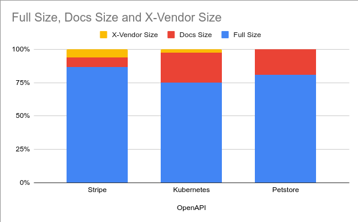

# APIs are getting larger, how do Overlays help?

Large APIs terrify me and they're getting bigger.

Overlays help. A little.

---

### Before we begin

And in the interest of being polite...

---

# Overlays - tl;dr

They're YAML files that take an API (YAML) document as input and produce a modifed document as output. 


---

# Warm up

---


# I'm Josh Ponelat
_(Pah-neh-lat)_

- Lead on Swagger open source at SmartBear.
- A software tool-maker, who doesn't mind JS.
- Not a nerd (mostly)

[@jponelat](https://twitter.com/jponelat)
https://ponelat.com 


---

# This talk

- The people involved in API definitions.
  - A look at use-cases that inspired Overlays 
- **How Overlays work**
- Shower thoughts
  - The size of API features
  - Are definitions Pets or Toys?
  - A tool or a standard?
  - Anti-patterns and pitfalls

---


# All these people are concerning

_...or the concerns of people involved in API design_

---

<!-- _backgroundImage: linear-gradient(132deg, rgb(65, 80, 95) 0.00%, rgb(36, 37, 38) 100.00%); -->
<!-- _color: white; -->


> API design is no longer the concern of one person. 
> Different areas are being handed over to dedicated folks.

                                      Archimedes, 250 BCE
---

# Documentation writer


**Responsible for**
Documentation and translations.

**Cares about**
Written word, developer experience and accuracy.

**Pains (related)**
Access to source files, copying changes to curated files.

---

## Documentation fields

- **Markdown descriptions**
- **Summaries**
- **Examples**

- Variations of the above for i18n
TODO: Image of documentation and/or translations


---

# DevOps engineer


**Responsible for**
Deployments, gateways and infrastructure

**Cares about**
API Security, URLs and server names

**Pains (related)**
Custom scripting to inject annotations

---

# DevOps engineer - Scripting

**Solving this today with custom scripting**

Annotating APIs to include infrastructure details.

```yaml
x-amazon-apigateway-cors: ...
x-ms-parameter-grouping: ...
x-google-audiences: ...
x-kusk: ...
```

```yaml
security: 
- Gateway stuff...
```

---

# Product Manager


**Responsible for**
Customers, "The Market"

**Cares about**
Visibility  curation 

**Pains (related)**
Juggling commitments

---

## Public and Private endpoints

```yaml
openapi: 3.1.0
paths:
  /foo:
    x-internal: true
  /bar: {}
  /baz: {}
```

```yaml
openapi: 3.1.0
paths:
  /foo:
    x-audiences: [public]
  /bar:
    x-audiences: [partner-bob]
```

---

_This page left intentionally blank_

---

# API Concerns


---

<!-- _color: white; -->
<!-- _backgroundImage: linear-gradient(0deg, rgba(59,213,235,1) 0%, rgba(2,139,158,1) 100%); -->

## Problems

- I need variations of an API
- The source inaccessable :( 
- The API shows too much informaation

---
# Overlay example

Putting together an Overlay document

```yaml
overlays: 1.0.0
extends: https://petstore.swagger.io/v2/swagger.json
actions:
- target: '$.paths."/pet/{petId}".get'
  update:
    description: Get those Pets!
    summary: Get Pets
```

---

# How Overlays work

- Target some things, then update or remove them.
- Each of these is a layer. 
- Several layers form an Overlay document.
- Think of these layers as Photoshop layers

TODO: Image of photoshop layers

---

# Target and action

TODO: Image highlighting the target and update action
Overlays are a list. Target something, then do something to it.

---
# Targeting with JSONPath

- Gaining traction as the defacto standard for querying JSON/YAMML. 
- Mostly because it's being standardized and because it aims to do one thing. Target nodes.

---

# JSONPath Examples
Examples:
- `$.paths.*.*.`
- `$.paths.*.*.parameters[?(@.name === "status")]`

---

# Changing things with update and remove

- `update` merges in a value
- `remove` ...uh, removes it.

Example
```yaml
target: '$.paths.*.*.tags[?(@ === "pet")]'
update: Pet
```

---

# APIs in the wild

---

# Sizes of API features



---

# APIs are heavy and Overlays separate out features

---

# Shower thoughts

---

# Thinking about APIs as Toys

- Should your API lovingly represent a single service, entirely as possible?
- Should your API cater to consumers, showing only what is needed?

TODO: Image of pet vs toy

---

### API shape proliferation

- One API could have many API (definitions), depending on consumers.
- The more shapes there are, the more composition will matter.

---

# A tool or a standard?

Why make yet-another-standard (the 15th one!)?

- It starts with a tool
- A standard is meant to have many tools
- Overlays are meant to be in many places

TODO: Image of diagram and the real thing.

---

# Why Overlays 

As APIs become larger, as API-shape proliferation occurs more energy will be spent on composition and in more places.

A standard encourages adoption not just on the command line, but in different contexts.

---

# Anti-patterns and pitfalls

TODO: Image of a pit

---

## Traits and incomplete definitions

We can move a lot of stuff out of definitions and into Overlays.
Such as traits, groups of operations. 
This could leave you with an incomplete definition, that now _requires_ an Overlay.
Instead of enriching it becomes necessary and that limits adoption. 

---

### An incomplete OpenAPI definition

```yaml
# Requires the overlay to be valid, missing 'info'
openapi: 3.0.3
paths: {}
```

```yaml
overlays: 1.0.0
actions:
- target: '$'
  update:
    info:
      title: Why am I here?
      version: 1.0.0
```

This is now structural, not enriching.
TODO: Image of structure

---

## Semantic whack-a-mole

**JSONPath** is awesome, but it doesn't consider semantic of the underlying specifications.

It is possible to describe things in different places, but with the same meaning.

Consider parameters in OpenAPI.

---

### Parameters in OpenAPI

```yaml
paths:
 /foo:
   parameters:
   - name: bob

   get:
     parameters:
	 - name: frank
   post:
     parameters: []
```


`$.paths.*.parameters` vs `$.paths.*.*.parameters`

---

## Do you need Overlays?

Start with -> "No, I don't need Overlays.". 
Then ponder the following.

- Do you need variations of an API?
- Is the source inaccessable? Code annotations, traffic inference.
- Is the API really large?
- Are there independent features of the API?

---

# Alternatives 

- Redocly-CLI
- JSONette
- Geneva https://github.com/smizell/geneva

---

# The folks behind this 

- The OpenAPI SIG, bi-weekly meet.
- We're made up of tooling vendors
- We need your help

---

# Closing remarks

- TODO: Thanks to the folks who helped me hone this talk into something more coherent.
- TODO: Links
