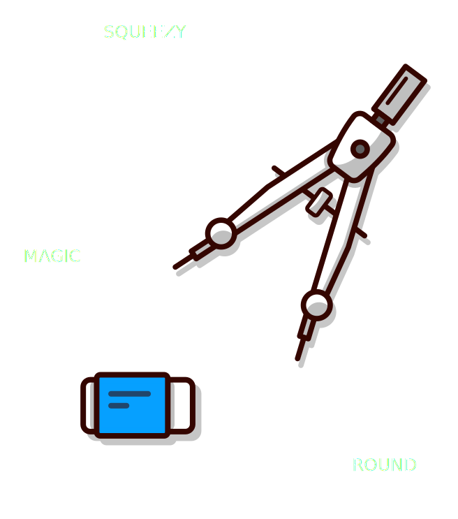
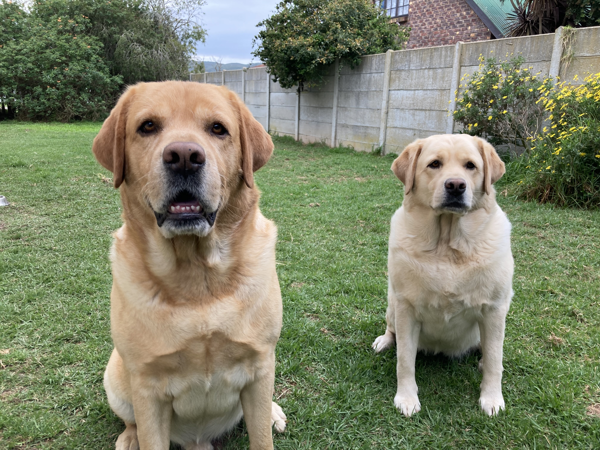
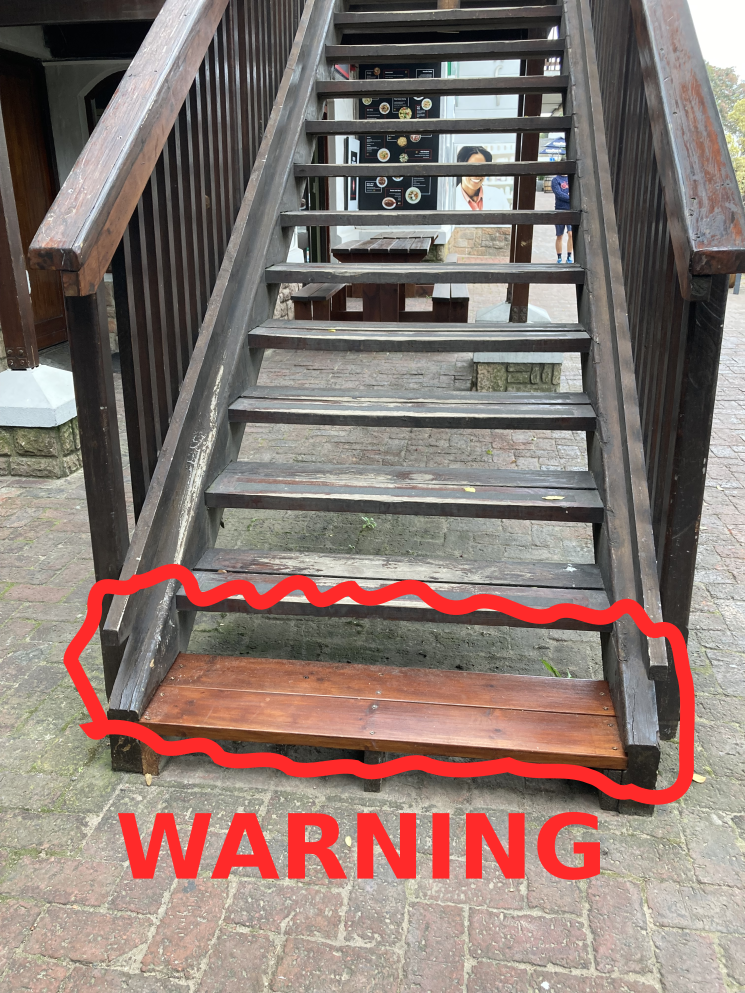
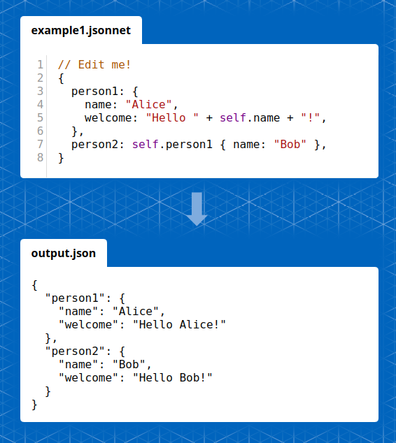

<!-- _backgroundImage: linear-gradient(132deg, rgb(65, 80, 95) 0.00%, rgb(36, 37, 38) 100.00%); -->
<!-- _color: white; -->

# APIs are getting larger, how do Overlays help?

They help separate concerns.

---

### Before we begin

And in the interest of being polite...

---

# Overlays - tl;dr

They're YAML files that take a YAML document as input and produce a modifed document as output. 


---

<!-- notes: Hands up if you've never heard of YAML, or how many use OAS/AAS/JS-->

# Warm up

---


# I'm Josh Ponelat
_(Pah-neh-lat)_

- Lead on Swagger (open source) at SmartBear.
- Product manager on SwaggerHub.
- But mostly a tool-maker.

[@jponelat](https://twitter.com/jponelat)
https://ponelat.com 

---

# This talk

- The _other_ people involved in APIs
   - Docs, DevOps and PMs
- **Overlays:** How they work
- Shower thoughts
  - APIs as Pets or Toys?
  - A tool or a standard?
  - Anti-patterns and pitfalls
  
---

# Level setting.

- Technically Overlays work with YAML, not APIs.
- OpenAPI/AsyncAPI/JSON Schema are all YAML(ish) based.
- I'll use the word API  to mean API Definition or Document, for this talk.
- If in doubt I'm usually referring to OpenAPI, not AsyncAPI/JSON Schema. Force of habit.

---

<!-- notes: Let's start with a quote -->

_This page intentionally left blank_


---

<!-- _backgroundImage: linear-gradient(132deg, rgb(65, 80, 95) 0.00%, rgb(36, 37, 38) 100.00%); -->
<!-- _color: white; -->


> API design is no longer the concern of one person. 
> Different areas are handled by different folks.

                                      Archimedes, 250 BCE
---


# It's not just about Barry

_Barry is a back-end engineer._

API design is now more than the shape of the API.

---

# The _other_ people

---

# Documentation writer

<!-- _class: offset-img-64 -->


**Responsible for**
Documentation and translations.

**Cares about**
Written word, developer experience and accuracy.

**Pains (related)**
Access to source files, copying changes to curated files.

---

## Documentation fields

- Markdown `description`, `summaries`, `examples`
- Variations of the above for i18n 
- Anything that makes it more "Stripe" like.


---

# DevOps engineer


**Responsible for**
Deployments, gateways and infrastructure

**Cares about**
API Security, URLs and server names

**Pains (related)**
Custom scripting to inject annotations

---

# DevOps engineer - Scripting

Annotating APIs to include infrastructure details, possibly via bespoke scripting.

```yaml
x-amazon-apigateway-cors: ...
x-ms-parameter-grouping: ...
x-google-audiences: ...
x-kusk: ...
```

```yaml
security: 
- ...Gateway specific
servers:
- ...Different envs
```

---

# Product Manager


**Responsible for**
Customers, "The Market"

**Cares about**
Visibility  curation 

**Pains (related)**
Juggling commitments

---

## Public and Private endpoints

```yaml
openapi: 3.1.0
paths:
  /foo:
    x-internal: true
  /bar: {}
```

_Alternative_
```yaml
openapi: 3.1.0
paths:
  /foo:
    x-audiences: [public]
  /bar:
    x-audiences: [partner-bob]
```

---
<!-- _backgroundImage: linear-gradient(132deg, rgb(65, 80, 95) 0.00%, rgb(36, 37, 38) 100.00%); -->
<!-- _color: white; -->
<!-- _class: middle -->

# Conclusion?

---

# Lots of concerns


---

<!-- _class: middle -->

# Drum roll...


---

# Overlays.

<!-- _class: middle -->

 

_The answer to everything_


---
# Overlays - An Example

```yaml
overlays: 1.0.0
info: 
  title: Add an emoji 
  version: 1.0.0
extends: https://petstore3.swagger.io/api/v3/openapi.json
actions: 
- target: '$.paths."/pet".post'
  update:
    summary: Add a new pet to the store 🐕!
```

---

# How do Overlays work?

- Target some parts of the document and mutate them.
- Layer in these changes together to form an Overlay document


---

# The parts of an Overlay document

1. Some boilerplate
2. Extend some (URL of an) API.
3. List of actions
	a). Each action: Target then mutate things.

---

# Boilerplate

```yaml
overlays: 1.0.0
```

Next  Info

---

# Boilerplate - Info

```yaml
overlays: 1.0.0
info: 
  title: Add an emoji 
  version: 1.0.0
```

Next  Extends

---

# Extend some API

```yaml
overlays: 1.0.0
info: 
  title: Add an emoji
  version: 1.0.0
extends: https://petstore3.swagger.io/api/v3/openapi.json
```

Next  Actions

---

# List of Actions

```yaml
overlays: 1.0.0
info: 
  title: Add an emoji
  version: 1.0.0
extends: https://petstore3.swagger.io/api/v3/openapi.json
actions: 
- # Your action...
```

Next  An Action

---

# An action

A **Target** and a **Mutation**

```yaml
# Target
target: ...

# Mutations
update: ...
remove: ...
```

_JP: Let's look at targetting things_

---

# Targeting with JSONPath

- Gaining traction as the defacto standard for querying JSON/YAML. 
- Mostly because it's being standardized and because it aims to do one thing, target nodes.


---

<!-- _class: offset-img-64 -->

# JSONPath Examples

Examples: 

- `$.paths."/pet".post'`  &mdash; One specific thing
- `$.paths.*.*.` &mdash; Wildcards
- `$.tags[?(@.name == "pet")]` &mdash; Filters/Expressions
- `$..description` &mdash; All decendants

---

# Mutating things 

- `update` merges in a value
- `remove` it uh... removes it.

```yaml
update: 
  summary: Add a new pet to the store 🐕!
  description: Something descriptive
```

```yaml
remove: true
```

---

# Putting them together into an action

```yaml
target: '$.paths."/pet".post'
update:
  summary: Add a new pet to the store 🐕!
```

---

# All together now!

```yaml
overlays: 1.0.0
info: 
  title: Add an emoji
  version: 1.0.0
extends: https://petstore3.swagger.io/api/v3/openapi.json
actions: 
- target: '$.paths."/pet".post'
  update:
    summary: Add a new pet to the store 🐕!
```

---

# We can now Overlay


- Patch files broadly or specifically
- Extract concerns 
- Handle (some) changes to the underlying APIs

---

# Shower thoughts
<!-- _backgroundImage: linear-gradient(132deg, rgb(65, 80, 95) 0.00%, rgb(36, 37, 38) 100.00%); -->
<!-- _color: white; -->

_...and design considerations_


---

<!-- _backgroundImage: linear-gradient(132deg, rgb(65, 80, 95) 0.00%, rgb(36, 37, 38) 100.00%); -->
<!-- _color: white; -->

# A tool or a standard?

Why make yet-another-standard (the 15th one!)?

- It starts with a tool
- A standard is meant to have many tools
- Overlays are meant to be in many places




---

<!-- _footer: Bowser and Blossom -->
# Pets vs Toys



**Pet:** Lovingly represent a single service, every detail? 

**Toy:** Cater to consumers, showing only what is needed? 


---

### API shape proliferation

One API (service) could have many API (definitions), depending on consumers.

> **Assumption:** The more APIs, the more that composition and Overlays will be needed.

---

# Anti-patterns and pitfalls



_Dodgy practices that can cause you to trip._

---

## Invalid definitions

We can move a lot of stuff out of APIs and into Overlays.
Possibly leaving our APIs invalid.

---

### An invalid OpenAPI definition

```yaml
# Requires the overlay to be valid, missing 'info'
openapi: 3.0.3
paths: {}
```

```yaml
overlays: 1.0.0
actions:
- target: '$'
  update:
    info:
      title: Why am I here?
      version: 1.0.0
```

**Bad:** Limits the amount of tooling you can use.

---

# Incomplete APIs 

Using Overlays to describe necessary parts of the API.
This could leave you with an incomplete definition, that now _requires_ an Overlay.

Instead of enriching, it becomes structural.

Consider: **Traits for OpenAPI**


---

## Semantic whack-a-mole

**JSONPath** is awesome, 
but it doesn't consider the semantics of the underlying specifications.

It is possible to miss targets using JSONPath. 

---

### Whack-a-parameter in OpenAPI

```yaml
paths:
 /foo:
   parameters:
   - name: bob

   get:
     parameters:
	 - name: frank
   post:
     parameters: []
```


1. `$.paths.*.*.parameters`  &mdash; usual
2. `$.paths.*.parameters` &mdash; not usually considered

---

## Do you need Overlays?

Start with, "No, I don't need Overlays."
&mdash; It is another moving part

Then ponder the following.

- Do you need variations of an API?
- Is the source inaccessable? Code annotations, traffic inference.
- Are there independent features of the API?

---

# Alternatives 



- Redocly-CLI https://github.com/Redocly/redocly-cli
- JSONette https://jsonnet.org/
- Geneva https://github.com/smizell/geneva

---

# The folks behind this 

- The OpenAPI SIG, bi-weekly meet.
- We're made up of tooling vendors
- We need your help
- Prototype: https://github.com/ponelat/overlays-cli (npm: `overlays-cli`)
- Specification: https://github.com/OAI/Overlay-Specification
- Discussion: https://github.com/OAI/Overlay-Specification/discussions

---

# Closing remarks

Thanks to the folks who helped hone this talk.

- Hezzie @Hezzieponelat
- Fabrizio Ferri-Benedetti @remoquete
- Adam Altman @adamaltman 
- Frank Kilcommins @fkilcommins
- Borrowed some img from illustrations.co


